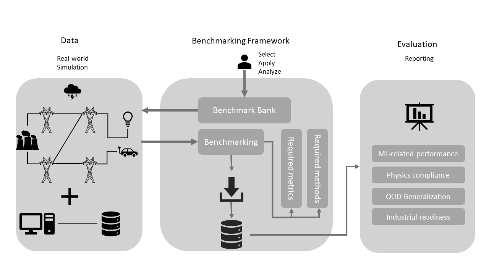

# LIPS : Learning Industrial physical simulation benchmark suite: the power grid case
This repository implements the benchmarking platform called LIPS and provides the necessary utilities to reproduce the generated datasets used in research.

The Readme file is organized as follows:

*   [1 Introduction](#introduction)
    * [1.1 What is LIPS?](#what-is-lips)
*   [2 Usage example](#usage-example)
    * [2.1 Train a simulator](#train-a-simulator)
    * [2.2 Reproducibility and evaluation](#reproducibility-and-evaluation)  
*   [3 Installation](#installation)
    *   [3.1 Setup a Virtualenv (optional)](#setup-a-virtualenv-optional)
    *   [3.2 Install from source](#install-from-source)
    *   [3.3 To contribute](#to-contribute)
*   [4 Getting Started](#getting-started)
*   [5 Documentation](#documentation)
*   [6 Contribution](#contribution)
*   [7 License information](#license-information)

## Introduction
Nowdays, the simulators are used in every domain to emulate a real-world situation or event or to reproduce the critical situations for which further investigation may be required. The simulators are based generally on physics equations and are costly in terms of time complexity. 

### What is LIPS
The learning industrial physical simulation benchmark suite allows to evaluate the performance of augmented simulators (aka surrogate models) specialized in a physical domain with respect to various evaluation criteria. The implementation is enough flexible to allow its adaptation to various domains such as power grids, transport, aeronotics etc. To do so, as it is depicted in the scheme provided in the figure below, the platform is designed to be modular and includes following modules: 

- the **Data** module of the platform may be used to import the required datasets or to generate some synthetic data (for power grids for now) 
- A **simulator** may access the provided data to train or evaluate the peformance. The developed platform gives also the flexibility to its users to design and implement their own simulators and evaluate its performance with baselines. Various baseline simulators are already implemented and could be used, e.g., Direct Current (DC) approximation and neural netowrk based simulators which are _Fully Connected_ (FC) model and _Latent Encoding of Atypical Perturbations network_ [(LEAP net)](https://github.com/BDonnot/leap_net).
- The **Evaluation** module allows to select the appropriate criteria among the available implemented metrics. Four category of metrics are provided, which are : 
  - ML-related metrics 
  - Physic compliance
  - Industrial readiness
  - Generalization metrics 
  


## Usage example
### Train a simulator

A simulator could be instantiated and trained if required easily as follows :
```python
from lips.augmented_simulators import FullyConnectedAS

my_simulator = FullyConnectedAS(name="test_FullyConnectedAS",
                                attr_x=("prod_p", "prod_v", "load_p", "load_q", "line_status", "topo_vect"),
                                attr_y=("a_or", "a_ex"),
                                sizes_layer=(300, 300, 300, 300),
                                lr=3e-4, 
                                layer=Dense,
                                layer_act="relu",
                                loss,
                                batch_size)
                           
my_simulator.train(nb_iter,
                   train_dataset,
                   val_dataset)

```

### Reproducibility and evaluation 
To reproduce the results of the submitted paper at _NeurIPS2021 Benchmark and Dataset track_, a class called `NeuripsBenchmark1` is provided which is sub class of a more general `Benchmark` class and whose purpose is to facilitate the data generation and the evaluation process. All the experimented datasets are already generated and provided under the _reference_data_ folder. The following script show how to use it quickly to reproduce the results : 

```Python
from lips.neurips_benchmark import NeuripsBenchmark1

# load the data from the provided path
path_benchmark = os.path.join("reference_data")
neurips_benchmark1 = NeuripsBenchmark1(path_benchmark=path_benchmark,
                                       load_data_set=True)

# evaluate an augmented simulator
metrics_per_dataset = neurips_benchmark1.evaluate_augmented_simulator(my_simulator)                   
```

## Installation
To be able to run the experiments in this repository, the users should install the last lips package from its github repository. The following steps show how to install this package and its dependencies from source.

### Requirements
- Python >= 3.6

### Setup a Virtualenv (optional)
#### Create a virtual environment

```commandline
cd my-project-folder
pip3 install -U virtualenv
python3 -m virtualenv venv_lips
```
#### Enter virtual environment
```commandline
source venv_lips/bin/activate
```

### Install from source
```commandline
git clone https://github.com/Mleyliabadi/LIPS
cd LIPS
git checkout ml-dev
pip3 install -U .
cd ..
```

### To contribute
```commandline
pip3 install -e .[recommended]
```

# Getting Started
Some Jupyter notebook are provided as tutorials for LIPS package. They are located in the 
[getting_started](getting_started) directories.   

# Documentation
The documentation is accessible from [here](https://lips.readthedocs.io/en/latest/index.html).

To generate locally the documentation:
```commandline
pip install sphinx
pip install sphinx-rtd-theme
cd docs
make clean
make html
```

# Contribution
* Supplementary features could be requested using github issues. 
* Other contributions are welcomed and can be integrated using pull requests.

# License information
Copyright 2022-2023 IRT SystemX & RTE

    IRT SystemX: https://www.irt-systemx.fr/
    RTE: https://www.rte-france.com/

This Source Code is subject to the terms of the Mozilla Public License (MPL) v2 also available 
[here](https://www.mozilla.org/en-US/MPL/2.0/)
