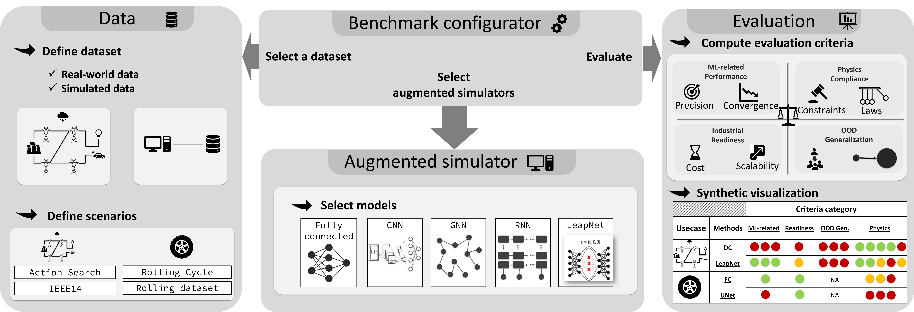
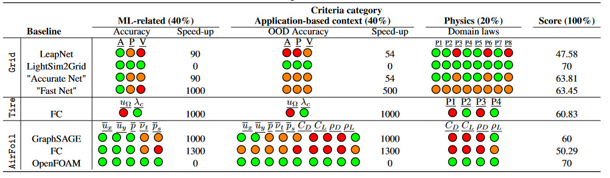

# LIPS - Learning Industrial Physical Simulation benchmark suite

This repository implements LIPS benchmarking platform. 
<!---
and provides the necessary utilities to reproduce the generated datasets used in research.
--->

Paper: https://openreview.net/pdf?id=ObD_o92z4p

The Readme file is organized as follows:

*   [1 Introduction](#introduction)
    * [1.1 What is LIPS?](#what-is-lips)
    * [1.2 Associated results](#associated-results)
*   [2 Usage example](#usage-example)
    * [2.1 Train a simulator](#train-a-simulator)
    * [2.2 Reproducibility and evaluation](#reproducibility-and-evaluation)
*   [3 Installation](#installation)
    *   [3.1 Setup a Virtualenv (optional)](#setup-a-virtualenv-optional)
    *   [3.2 Install from source](#install-from-source)
    *   [3.3 To contribute](#to-contribute)
*   [4 Access the Codabench page](#codabench)
*   [5 Getting Started](#getting-started)
*   [6 Documentation](#documentation)
*   [7 Contribution](#contribution)
*   [8 License information](#license-information)
*   [9 Citation](#citation)

## Introduction
Physical simulations are at the core of many critical industrial systems. However, today's physical simulators have some limitations such as computation time, dealing with missing or uncertain data, or even non-convergence for some feasible cases. Recently, the use of data-driven approaches to learn complex physical simulations has been considered as a promising approach to address those issues. However, this comes often at the cost of some accuracy which may hinder the industrial use.

<!--Nowdays, the simulators are used in every domain (power grids, transport, aeronautics, radiation, etc.) to emulate a real-world situation or phenomena, and also to reproduce the critical situations for which further investigation may be required. The simulators are based generally on physics equations and are costly in terms of time complexity.]
-->

### What is LIPS
To drive the above mentioned new research topic towards a better real-world applicability, we propose a new benchmark suite "Learning Industrial Physical Simulations" (LIPS) to meet the need of developing efficient, industrial application-oriented, augmented simulators. The proposed benchmark suite is a modular and configurable framework that can deal with different physical problems. To do so, as it is depicted in the scheme, the LIPS platform is designed to be modular and includes following modules:

- **Data:** This module may be used to import the required datasets or to generate some synthetic data using physical solvers (*NB*. depending on the use case, the physical solver may not yet be avaiable);

- **Augmented Simulator:** This module offers a list of already implemented data-driven models which could be used to augment or to substitute the physical solvers. The datasets imported using `Data` module may be used to learn these models. A set of instructions are also provided in [Contribution](#contribution) section and in related jupyter notebooks (see more details in [Getting started](#getting-started)) for who would like to implement their own augmented simulator and evaluate its performance using LIPS;

- **Benchmark configurator:** This module takes a dataset related to a specific task and usecase, an already trained augmented simulator (aka model) and a set of metrics and call the evaluator module to assess the performance of the model;

- **Evaluator:** This module is responsible to evaluate the performance of a selected benchmark. To define how to assess such benchmark performance, we propose a set of four generic categories of criteria:

  - <u>ML-related metrics</u>: Among classical ML metrics, we focus on  the trade-offs of typical model accuracy metrics such as Mean Absolute Error (MAE) vs computation time (optimal ML inference time without batch size consideration as opposed to application time later);

  - <u>Physics compliance</u>: Physical laws compliance is decisive when simulation results are used to make consistent real-world decisions. Depending on the expected level of criticality of the benchmark, this criterion aims at determining the type and number of physical laws that should be satisfied;
  - <u>Industrial readiness</u>:*  When deploying a model in real-world applications, it should consider the real data availability and scale-up to large systems. We hence consider:
    1) *Scalability*: the computational complexity of a surrogate method should scale well with respect to the problem size, e.g. number of nodes in power grid, mesh refinement level in pneumatic;
    2) *Application Time*: as we are looking for a model tailored to a specific application, we measure the computation time when integrated in this application. To this end, we define a realistic application-dependent batch size, which may affect the speed-up.
  - <u>Application-based out-of-distribution (OOD) generalization</u>: For industrial physical simulation, there is always some expectation to extrapolate over minimal variations of the problem geometry depending on the application. We hence consider ood geometry evaluation such as unseen power grid topology or unseen pneumatic mesh variations. 

  
<!--The learning industrial physical simulation benchmark suite allows to evaluate the performance of augmented simulators (aka surrogate models) specialized in a physical domain with respect to various evaluation criteria. The implementation is enough flexible to allow its adaptation to various domains such as power grids, transport, aeronotics etc. To do so, as it is depicted in the scheme provided in the figure below, the platform is designed to be modular and includes following modules:

- the **Data** module of the platform may be used to import the required datasets or to generate some synthetic data (for power grids for now)
- A **simulator** may access the provided data to train or evaluate the peformance. The developed platform gives also the flexibility to its users to design and implement their own simulators and evaluate its performance with baselines. Various baseline simulators are already implemented and could be used, e.g., Direct Current (DC) approximation and neural netowrk based simulators which are _Fully Connected_ (FC) model and _Latent Encoding of Atypical Perturbations network_ [(LEAP net)](https://github.com/BDonnot/leap_net).
- The **Evaluation** module allows to select the appropriate criteria among the available implemented metrics. Four category of metrics are provided, which are :
  - ML-related metrics
  - Physic compliance
  - Industrial readiness
  - Generalization metrics
-->



### Associated results
To demonstrate this ability, we propose in this paper to investigate two distinct use-cases with different physical simulations, namely: Power Grids, Pneumatics and Air Foils. For each use case, several benchmarks (aka tasks or scenarios) may be described and assessed with existing models. In the figure below, we show an example of the results obtained for a specific task associated with each use case. To ease the reading of the numerical comparison table, the performances are reported using three colors computed on the basis of two thresholds. The meaning of colors is described below:

- $\color{green}Greate$: Designates the best performance that could be obtained for a metric and an associated variable. The metric value should be lower than the first threshold;
- $\color{orange}Acceptable$: Designates an acceptable performance that could be obtained for a metric and an associated variable. The metric value should be between the first and the second thresholds;
- $\color{red}Not\ acceptable$: Designates a not acceptable performance using a metric and an associated variable. The metric value should higher than the second threshold.

 The number of circles corresponds to the number of variables or laws that are evaluated.

As it can be seen, none of the models perform well under all expected criteria, inviting the community to develop  new industry-applicable solutions and possibly showcase their performance publicly upon online LIPS instance on Codabench.



The final score is computed on the basis of the obtained results for each metric (more information concerning the scoring algorithm will be provided).

## Usage example
### Instantiate a benchmark
The paths should correctly point-out to generated data ([DATA_PATH](https://github.com/Mleyliabadi/LIPS/tree/main/reference_data)) and benchmark associated config file ([CONFIG_PATH](https://github.com/Mleyliabadi/LIPS/blob/main/configurations)). The log path (`LOG_PATH`) could be set by the user.

```python
from lips.benchmark import PowerGridBenchmark

benchmark1 = PowerGridBenchmark(benchmark_name="Benchmark1",
                                benchmark_path=DATA_PATH,
                                load_data_set=True,
                                log_path=LOG_PATH,
                                config_path=CONFIG_PATH
                               )
```
### Train a simulator
A simulator (based on tensorflow) could be instantiated and trained if required easily as follows:
```python
from lips.augmented_simulators.tensorflow_models import TfFullyConnected
from lips.dataset.scaler import StandardScaler

tf_fc = TfFullyConnected(name="tf_fc",
                         bench_config_name="Benchmark1",
                         scaler=StandardScaler,
                         log_path=LOG_PATH)

tf_fc.train(train_dataset=benchmark1.train_dataset,
            val_dataset=benchmark1.val_dataset,
            epochs=100
           )

```
For each architecture a config file is attached which are available [here](https://github.com/Mleyliabadi/LIPS/tree/main/configurations/powergrid/simulators) for powergrid use case.
### Reproducibility and evaluation
The following script show how to use the evaluation capacity of the platform to reproduce the results on all the datasets. A config file (see [here](https://github.com/Mleyliabadi/LIPS/blob/main/configurations/powergrid/benchmarks/l2rpn_case14_sandbox.ini) for powergrid use case) is associated with this benchmark and all the required evaluation criteria can be set in this configuration file.

```Python
tf_fc_metrics = benchmark1.evaluate_simulator(augmented_simulator=tf_fc,
                                              eval_batch_size=128,
                                              dataset="all",
                                              shuffle=False
                                             )
```

## Installation
To be able to run the experiments in this repository, the users should install the last lips package from its github repository. The following steps show how to install this package and its dependencies from source.

### Requirements
- Python >= 3.6

### Setup a Virtualenv (optional)
#### Create a Conda env (recommended)
```commandline
conda create -n venv_lips python=3.10
conda activate venv_lips
```
#### Create a virtual environment

```commandline
cd my-project-folder
pip3 install -U virtualenv
python3 -m virtualenv venv_lips
```
#### Enter virtual environment
```commandline
source venv_lips/bin/activate
```

### Install using Python Package Index (PyPI)
```commandline
pip install lips-benchmark .[recommended]
```

### Install from source
```commandline
git clone https://github.com/IRT-SystemX/LIPS.git
cd LIPS
pip3 install -U .[recommended]
cd ..
```

### To contribute
```commandline
pip3 install -e .[recommended]
```
# Codabench
To see the leaderboard for benchmarking tasks, refer to the codabench page of the framework, accessible from this [link](http://htmlpreview.github.io/?https://github.com/Mleyliabadi/LIPS/blob/main/codabench/codabench.html).

# Getting Started
Some Jupyter notebook are provided as tutorials for LIPS package. They are located in the
[getting_started](getting_started) directories.

# Documentation
The documentation is accessible from [here](https://lips.readthedocs.io/en/latest/index.html).

To generate locally the documentation:
```commandline
pip install sphinx
pip install sphinx-rtd-theme
cd docs
make clean
make html
```

# Contribution
* Supplementary features could be requested using github issues.
* Other contributions are welcomed and can be integrated using pull requests.

# FAQ
## Pytorch
To be able to use the torch library with GPU, you should consider multiple factors:
* if you have a compatible GPU, in this case you can install the last cuda driver (11.6) and install torch using the following command:
```commandline
pip install torch --pre --extra-index-url https://download.pytorch.org/whl/nightly/cu116
```
To take the advantage of the GPU when training models, you should indicate it via the `device` parameter as follows:
```python
from lips.augmented_simulators.torch_models.fully_connected import TorchFullyConnected
from lips.augmented_simulators.torch_simulator import TorchSimulator
from lips.dataset.scaler import StandardScaler

torch_sim = TorchSimulator(name="torch_fc",
                           model=TorchFullyConnected,
                           scaler=StandardScaler,
                           device="cuda:0",
                          )
```

* Otherwise, if you want use only CPU for the training of augmented simulators, you could simply use the version installed following the the requirements and set the device parameter to `cpu` when training as follows:
```python
torch_sim = TorchSimulator(name="torch_fc",
                           model=TorchFullyConnected,
                           scaler=StandardScaler,
                           device="cpu",
                          )
```

## Tensorflow
To be able to use Tensorflow, you should already install a cuda compatible version with your tensorflow package. From Tensorflow 2.4 the cuda version >= 11.0 is required. Once you have get and installed cuda driver (we recommend version 11.5) from [here](https://developer.nvidia.com/cuda-toolkit-archive), you should also get corresponding cuDNN package from [here](https://developer.nvidia.com/rdp/cudnn-archive) and copy the contents in corresponding folders in cuda installation directory. Finally, you should set some environment variables which are discussed in this [link](https://www.tensorflow.org/install/gpu) for both linux and windows operating systems. For windiows you can do the following in command line:
```commandline
SET PATH=C:\Program Files\NVIDIA GPU Computing Toolkit\CUDA\v11.5\bin;%PATH%
SET PATH=C:\Program Files\NVIDIA GPU Computing Toolkit\CUDA\v11.5\extras\CUPTI\lib64;%PATH%
SET PATH=C:\Program Files\NVIDIA GPU Computing Toolkit\CUDA\v11.5\include;%PATH%
SET PATH=C:\tools\cuda\bin;%PATH%
SET LD_LIBRARY_PATH=C:\Program Files\NVIDIA GPU Computing Toolkit\CUDA\v11.5\lib\x64
```
However, after setting variables if you encounter some \*.dll not found when importing tensorflow library, you could indicating the path to cuda installation in your code before importing tensorflow package as follows:
```python
import os
os.add_dll_directory("C:/Program Files/NVIDIA GPU Computing Toolkit/CUDA/v11.5/bin")
```
And then you can test your installation by running:
```python
import tensorflow as tf
tf.config.list_physical_devices()
```
Where in its output the GPU device should be appeared as following:
```
[PhysicalDevice(name='/physical_device:CPU:0', device_type='CPU'),
 PhysicalDevice(name='/physical_device:GPU:0', device_type='GPU')]
```

# License information
Copyright 2022-2023 IRT SystemX & RTE

    IRT SystemX: https://www.irt-systemx.fr/
    RTE: https://www.rte-france.com/

This Source Code is subject to the terms of the Mozilla Public License (MPL) v2 also available
[here](https://www.mozilla.org/en-US/MPL/2.0/)

# Citation

    @article{leyli2022lips,
        title={LIPS-Learning Industrial Physical Simulation benchmark suite},
        author={M. Leyli-Abadi, and A. Marot, Antoine and J. Picault, and D. Danan and M. Yagoubi, B. Donnot, S. Attoui, P. Dimitrov, A. Farjallah, C. Etienam},
        journal={Advances in Neural Information Processing Systems},
        volume={35},
        pages={28095--28109},
        year={2022}
    }
